Parking lot website

Full responsive commercial website - done as a final project at the end of CodersLab bootcamp.

Website developed on personal domain [_here_](https://parking24h-krakow.pl)

## Table of Contents

* [General Info](#general-information)
* [Technologies Used](#technologies-used)
* [Screenshots](#screenshots)
* [Setup](#setup)
* [Project Status](#project-status)
* [Room for Improvement](#room-for-improvement)
* [Contact](#contact)

## General Information

- Project created as a final draft of CodersLab bootcamp.
- Commercial website of neighborhood parking lot with easy form allowing user send task about free parking places,
  clearly visible pricing list, map with parking location pin, section with pdf rules and photo gallery.
- Idea and design conceived by myself.
- Website is in Polish, compliant with today's web standards.
- The point was to create a website working on desktop as well as on mobile devices (phones, tablets).
- The main users of an application will be elderly people, so assumption was simple, clear design, easy to use.

## Technologies Used

- React
- React Router
- React leaflet map
- React pdf viewer
- Bootstrap
- Emailjs
- HTML
- SCSS
- JavaScript

## Screenshots

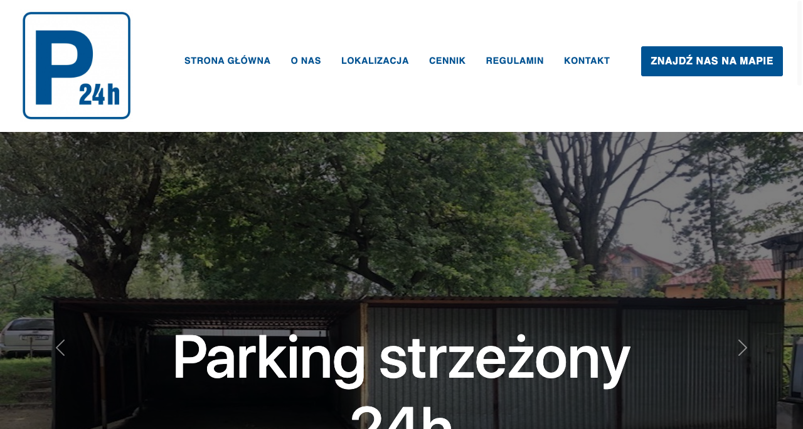
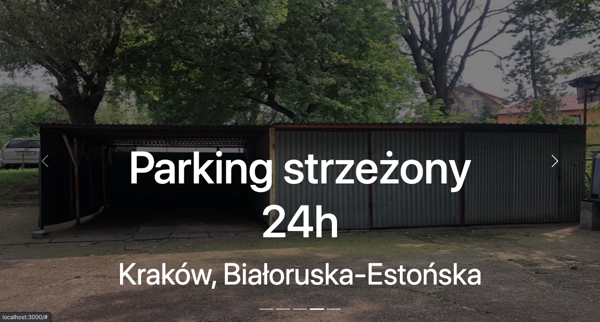

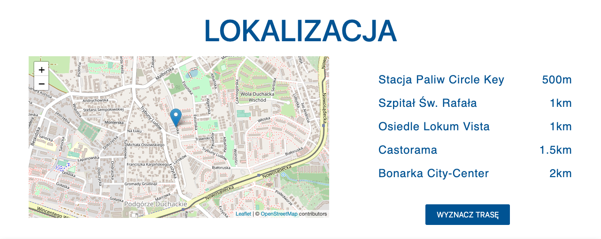
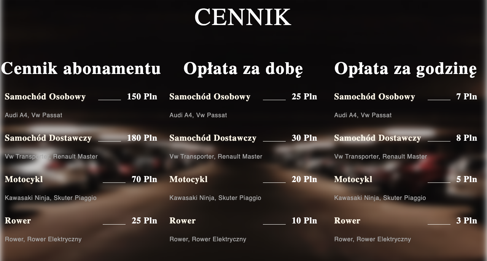
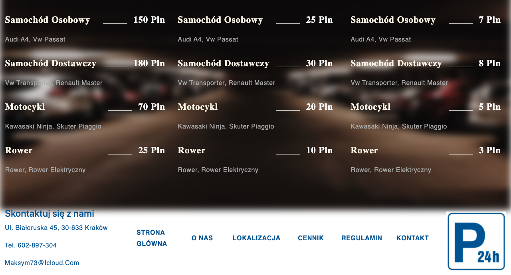
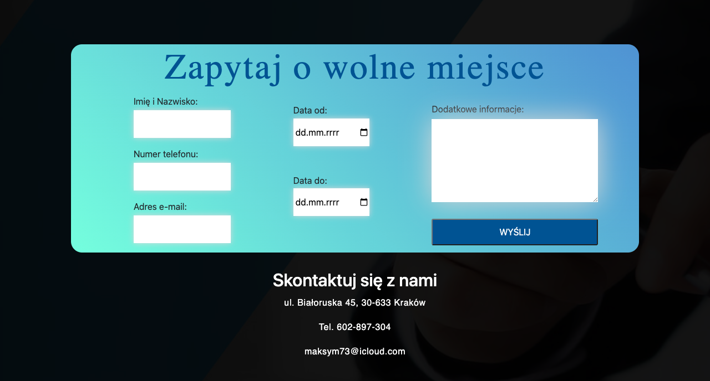
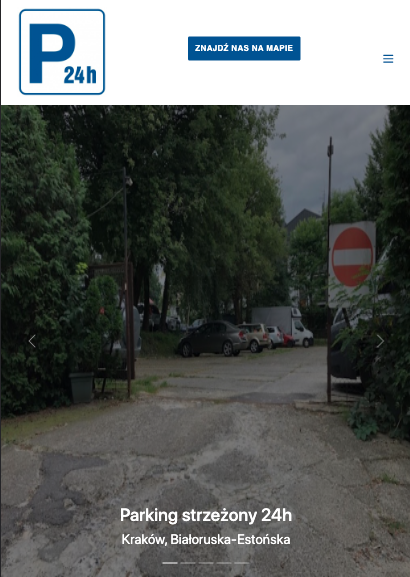
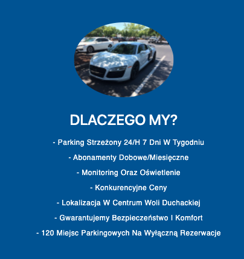
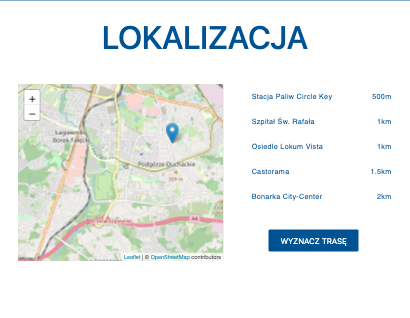
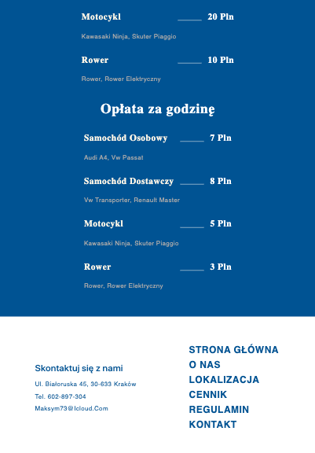
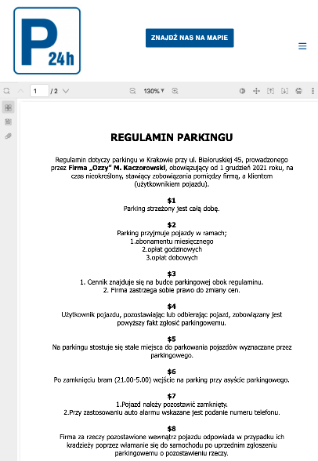
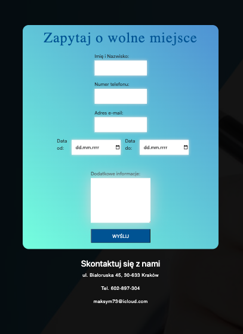
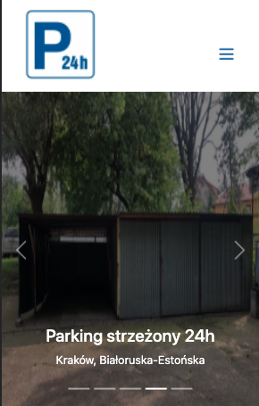
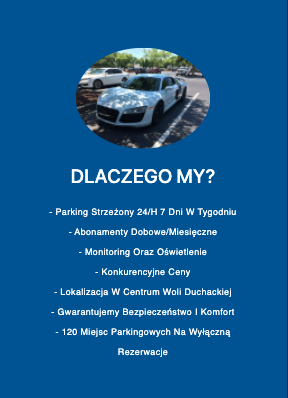

## Setup

- Download or clone repository / `git clone repo_address`
- Install dependencies / `npm install`
- Start app by `npm start`

## Project Status

[//]: # (Assumed learning task completed.)

## Room for Improvement

- Admin panel with a simple database where owner would be able to manage company clients, free parking spots, issue
  invoices.
- LogIn / LogOut user features
- Advanced form connected with database where user asking about free space would get a respond from database about
  availability.
- Online payment gateway making it easier for the user to pay for the subscription

## Contact

Created by [_Duckjaniels_](https://www.linkedin.com/in/maksym-kaczorowski-008b3a154/) - feel free to contact me!